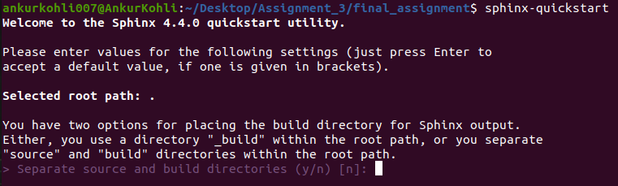
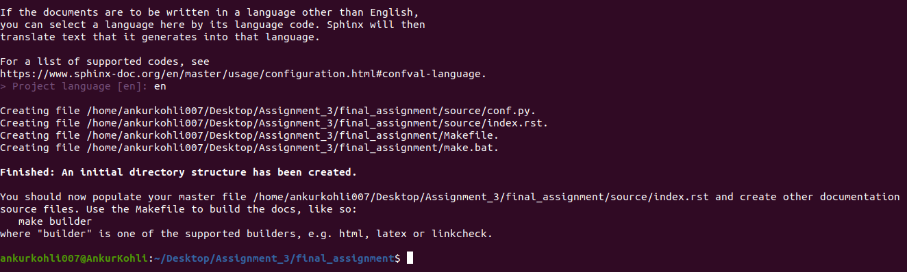
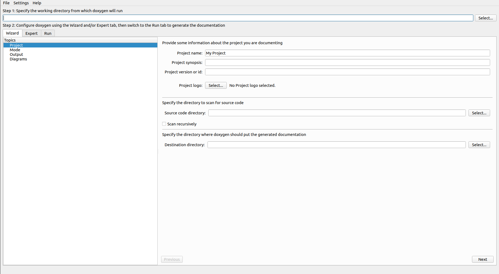
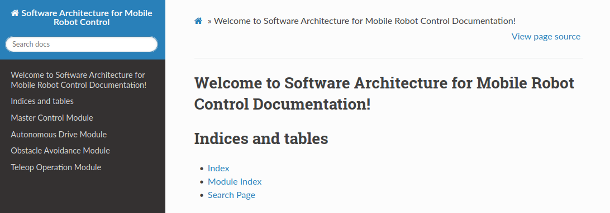
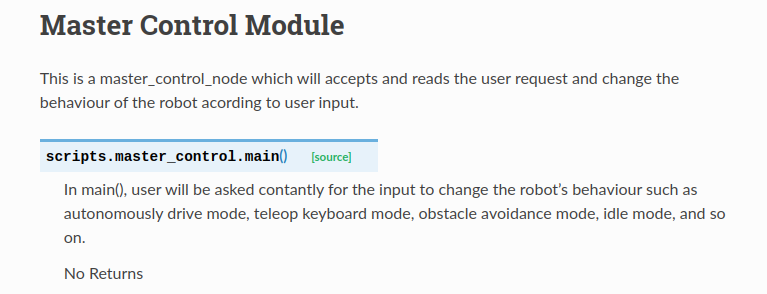
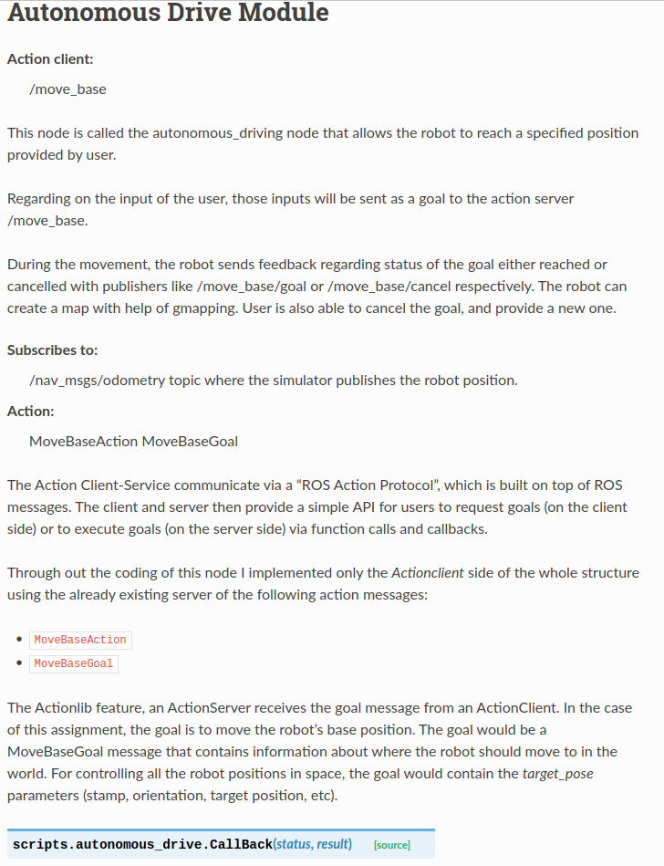
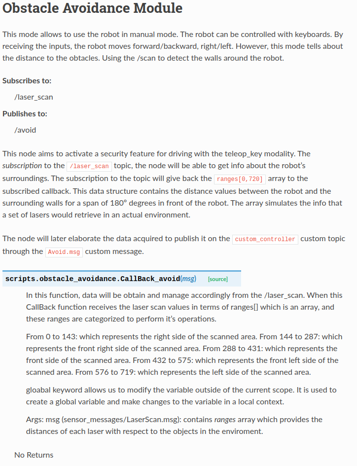
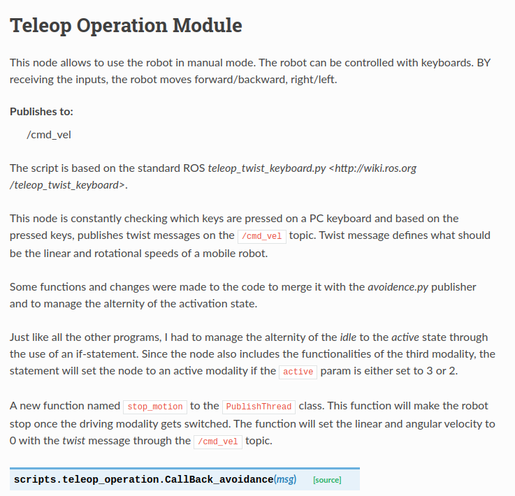

[Research Track II](https://corsi.unige.it/en/off.f/2022/ins/60236)<br>
**Documentor:** [Ankur Kohli](https://github.com/ankurkohli007)<br>
[M.Sc Robotics Engineering](https://corsi.unige.it/corsi/10635)<br>
[University of Genoa (UniGe)](https://unige.it/en)<br>
**Supervisor:** [Prof. Carmine Tommaso Recchiuto](https://rubrica.unige.it/personale/UkNDWV1r)

# Documentation for Software Architecture for Mobile Robot Control 

## Abstract
Documents describing the software system, including technical design documents, software requirements, and UML diagrams. This documentation that’s partly auto-generated from docstrings in [my code](https://github.com/ankurkohli007/Research_Track_I_Assignment_3.git). This documentation is developed for the the project [Software Architecture for Mobile Robot Control](https://github.com/ankurkohli007/Research_Track_I_Assignment_3.git). For this, ***Sphinx*** tool is used. 

## Introduction
In this documentation, [Sphinx](https://www.sphinx-doc.org/en/master/) tool is used. *Sphinx* was originally created for **Python**, but it has now facilities for the documentation of software projects in a range of languages. Sphinx uses [reStructuredText](https://docutils.sourceforge.io/rst.html) as its markup language. 

Here are some of Sphinx’s major features:

* **Output formats:** HTML (including Windows HTML Help), LaTeX (for printable PDF versions), ePub, Texinfo, manual pages, plain text.
* **Extensive cross-references:** semantic markup and automatic links for functions, classes, citations, glossary terms and similar pieces of information.
* **Hierarchical structure:** easy definition of a document tree, with automatic links to siblings, parents and children.
* **Automatic indices:** general index as well as a language-specific module indices.
* **Code handling:** automatic highlighting using the Pygments highlighter.
* **Extensions:** automatic testing of code snippets, inclusion of docstrings from Python modules (API docs) via built-in extensions, and much more functionality via third-party extensions.
* **Themes:** modify the look and feel of outputs via creating themes, and re-use many third-party themes.
* **Contributed extensions:** dozens of extensions contributed by users; most of them installable from PyPI.

## Installation

To create documentation, *Sphinx* tool is required on your system. To install Sphinx follow the steps given below:

```
sudo apt-get install python3-sphinx
```
*For Docker user execute the aforementioned command without sudo*

```
pip3 install breathe
```
```
pip3 install sphinx-rtd-theme
```
With these three commands, you are installing spinhx, plus breathe, which is a tool for integrating doxygen documentation in sphinx, and thus comment also cpp code, and the ReadTheDocs theme, one of the most used theme for creating documentation.

After installation of *Sphinx*, follow the steps given below:

**Step 1:** 
```
sphinx-quickstart
```
After running the command, accept the defaults. It’ll look something like this: 



Figure above shows that *Separate source and build directories (y/n) [n]: n*. 

**Step 2:** Now, press entre write the ***Project Name, Author Name, Project Release***. as shown in figure below.


**Step 3:** After entering the required details, now choose the language in which documentation to be prepared. 



Figure above shows the language choosen for Documentation.

## Documentation Preparation

After intallation, now you are ready to create documentation. After execution of ```sphinx-quickstart```, you can see ***conf.py*** file in your given directory path, which still needs to be updated. Now add the required things as given below from *line 13*: 

```
import os
import subprocess
import sys
sys.path.insert(0, os.path.abspath('.'))
subprocess.call('doxygen Doxyfile.in', shell=True)
#-- Project information -----------------------------------------------------
```
This is needed to run doxygen, generating an xml file which will be used by sphinx for creating its own documentation, and to make the path absolute, so to be able to find all source code.

Now add the given below extenions in *conf.py*. 

```
extensions = [
'sphinx.ext.autodoc',
'sphinx.ext.doctest',
'sphinx.ext.intersphinx',
'sphinx.ext.todo',
'sphinx.ext.coverage',
'sphinx.ext.mathjax',
'sphinx.ext.ifconfig',
'sphinx.ext.viewcode',
'sphinx.ext.githubpages',
"sphinx.ext.napoleon",
'sphinx.ext.inheritance_diagram',
'breathe'
]
```
After adding extensions, now make changes in *line 64* of conf.py file such as:
```
highlight_language = 'c++'
source_suffix = '.rst'
master_doc = 'index'
html_theme = 'sphinx_rtd_theme'
```
This will set the ReadTheDocs theme, and let sphinx find the source code.

Now make changes after *line 74* in *conf.py* file only.
```
# -- Extension configuration -------------------------------------------------
# -- Options for intersphinx extension ---------------------------------------
# Example configuration for intersphinx: refer to the Python standard library.
intersphinx_mapping = {'https://docs.python.org/': None}
# -- Options for todo extension ----------------------------------------------
# If true, `todo` and `todoList` produce output, else they produce nothing.
todo_include_todos = True
# -- Options for breathe
breathe_projects = {
"turtlesim_controller": "_build/xml/"
}
breathe_default_project = "turtlesim_controller"
breathe_default_members = ('members', 'undoc-members')
```
Finally, we set the configuration of some of the extensions used (intersphinx, todo, and
breathe).

After making the changes in *conf.py* file, run the command given below for ***Doxygen GUI***:
```
doxywizard
```
Now, ***Doxygen GUI*** will open as shown in figure below:



Now choose the ***working directory from which doxygen will run*** in *Step 1* as shown in figure above. After choosing the folder path, Provide some information about the project you are documenting such as: **Project Name, Project synopsis, Project version or id, Project logo** (if any), and so on. After giving the information , now ***specify the directory to scan for source code*** in *Step 2* which means add the source code directory. Mark the box for ***scan recursively***. After this, ***specify the directory where doxygen should put the generated doucmentation*** i.e. ***Destination directory*** as shown in the figure above. In our case, desination directory is *_build*. Save this as ***Doxygen.in***.

Finally, modify the ***index.rst*** script, which will be used by sphinx (together with
conf.py and (indirectly) with Doxygen.in, to build our documentation). After *line 22* add 

```
Module Name
=====================
.. automodule:: scripts.script_name
   :members:
```
*Note: Module names depends on the nodes that designed during development of the code.*

Now run the command:
```
make html
```
This command will create ***indext.html*** file which is in folder *_build/html*. 



Figure above shows the *html page* of the documentation's created. 

## Outcomes

Now, the generated *HTML* files, inside *_build/html* folder, chevk the detailed documenation of the modules.

Master Control Module, detailed about the master node. 

 

Figure above shows the HTML page about the *master_control script*.


Autonomous Drive Module, detailed about the robot's operation 1 node. 

 

Figure above shows the HTML page about the *autonomous_drive script*. Also, get the detailed of the scripts by clicling on source from the command given *scripts.autonomous_drive.CallBack(status, result)[source]*.


Obstacle Avoidance Module, detailed about the robot's operation 2 node. 

 

Figure above shows the HTML page about the *obstacle_avoidance script*.


Teleop Operation Module, detailed about the robot's operation 3 node. 

 

Figure above shows the HTML page about the *teleop_operation script*.

## GitHub Page

Finally, update your documentation online on **GitHub**, so that it could be visualized by people using repository.

Use GitHub to publish your doucmentation online. For this, follow the steps given below:

* Create a folder docs, containing documentation.
* In case of Sphinx documentation, add an empty file, in the docs folder, named ".nojekyll" (this is needed for using
the sphinx layout).
* Lastly, go to Settings of GitHub -> Pages.
* On Pages section, make changes under GitHub Pages -> Sources. Change *branch* from none to ***main***, and */root* folder to ***/docs***. Finally, save the settings and activate an *url* which may be used to visualize the documentation.

## Outcome

To view the documentation visit the link given below: 

https://ankurkohli007.github.io/Research_Track_II_Assignment_1_Documentation_Sphinx/ 

This the *url* for the Sphinx Documentaion of the Software Architecture for Mobile Robot Control. 
